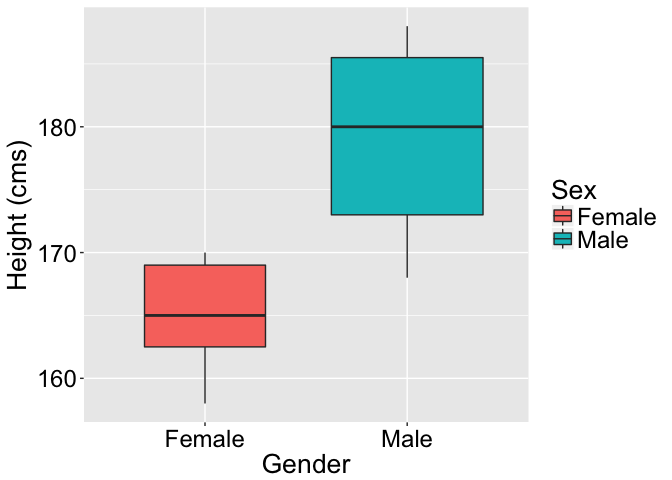

Simple Example
================
Julian Stander
04/02/2018

Comparing the Underlying Means of Two Groups
============================================

Comparing the Underlying Means of Two Groups Hello!
---------------------------------------------------



Comparing the Underlying Means of Two Groups, continued
-------------------------------------------------------

We can ask:

-   Is there an height between females and males?

This is a **profound question**. We are not asking whether there is a difference between the mean height of females and the mean height of males in the data collected.

We are asking, *more generally*, whether there is a difference between the mean height of females and the mean height of males in a much bigger *population*.

*t*-test: Underlying Difference in Mean
---------------------------------------

To answer this question, we can use a *t*-test:

``` r
t.test(Height ~ Sex, data = qd, var.equal = TRUE)
```

    # 
    #   Two Sample t-test
    # 
    # data:  Height by Sex
    # t = -4.5075, df = 16, p-value = 0.0003579
    # alternative hypothesis: true difference in means is not equal to 0
    # 95 percent confidence interval:
    #  -20.374200  -7.340085
    # sample estimates:
    # mean in group Female   mean in group Male 
    #             165.1429             179.0000

[This is a continuation of section](#hello).
