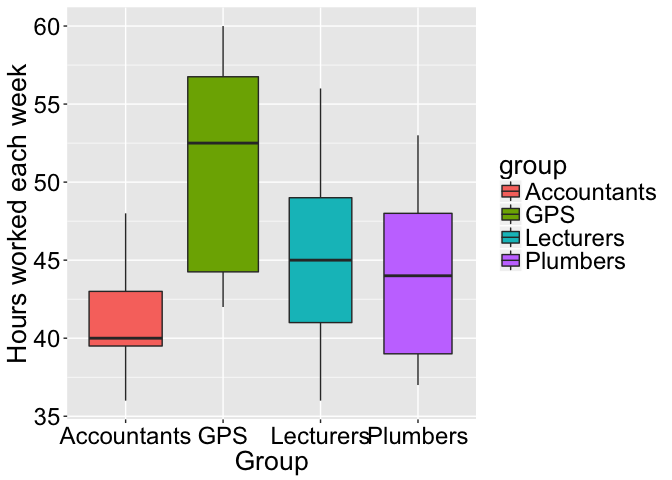

Simple Example
================
Julian Stander
04/02/2018

Comparing the Underlying Means of Two Groups
============================================

Comparing the Underlying Means of Two Groups
--------------------------------------------


Comparing the Underlying Means of Two Groups, continued
-------------------------------------------------------

We can ask:

-   Is there an height between females and males?

This is a **profound question**. We are not asking whether there is a difference between the mean height of females and the mean height of males in the data collected.

We are asking, *more generally*, whether there is a difference between the mean height of females and the mean height of males in a much bigger *population*.

*t*-test: Underlying Difference in Mean
---------------------------------------

To answer this question, we can use a *t*-test:

``` r
t.test(Height ~ Sex, data = qd, var.equal = TRUE)
```

    # 
    #   Two Sample t-test
    # 
    # data:  Height by Sex
    # t = -4.5075, df = 16, p-value = 0.0003579
    # alternative hypothesis: true difference in means is not equal to 0
    # 95 percent confidence interval:
    #  -20.374200  -7.340085
    # sample estimates:
    # mean in group Female   mean in group Male 
    #             165.1429             179.0000

*p*-value: Underlying Difference in Mean
----------------------------------------

We need to focus on the *p*-value

    # [1] 0.0003579246

In general, if the *p*-value is less that 0.05, .

In this case, the *p*-value is considerably less than 0.05. Therefore, we conclude that

-   .

Obtaining the *p*-value using the  Function
------------------------------------------

We can obtain the above *p*-value 0.0003579246 in a different way

-   using the function for inear odelling:

``` r
m <- lm(Height ~ Sex, data = qd)
summary(m)
```

    #              Estimate Std. Error  t value     Pr(>|t|)
    # (Intercept) 165.14286   2.403229 68.71707 3.326021e-21
    # SexMale      13.85714   3.074221  4.50753 3.579246e-04

Comparing the Underlying Means of Two Groups
--------------------------------------------

We can also ask:

-   Is the mean height of females the mean height of males of students?

Again, we are not asking whether the mean height of females is less than the mean height of males in the data collected.

We are asking, *more generally*, whether the mean height of females is less than the mean height of males in a much bigger *population*.

*t*-test: Is the Mean Height of Females Less Than the Mean Height of Males in the Population?
---------------------------------------------------------------------------------------------

To answer this question, we can use a *t*-test, with

:

``` r
t.test(Height ~ Sex, data = qd, var.equal = TRUE, 
       alternative = "less")
```

    # 
    #   Two Sample t-test
    # 
    # data:  Height by Sex
    # t = -4.5075, df = 16, p-value = 0.000179
    # alternative hypothesis: true difference in means is less than 0
    # 95 percent confidence interval:
    #       -Inf -8.489911
    # sample estimates:
    # mean in group Female   mean in group Male 
    #             165.1429             179.0000

*p*-value: Is the Mean Height of Females Less Than the Mean Height of Males in the Population?
----------------------------------------------------------------------------------------------

We need to focus on the *p*-value

    # [1] 0.0001789623

If the *p*-value is less that 0.05, we conclude that

-   .

-   What do you conclude?

Comparing the Underlying Means of More Than Two Groups
======================================================

Comparing the Underlying Means of More Than Two Groups: Some Data
-----------------------------------------------------------------

Consider these data on the number of hours worked in a week by randomly selected accountants, GPs, lecturers and plumbers:

\begin{tabular}{l|ccccccccccc}\hline\hline
Accountants & 45& 38& 40& 42& 48& 37& 44& 40& 39& 42& 41\\
  & 40 & 36& 40& 48 & & & & & & & \\ \hline
GPs & 60& 57& 44& 52 & 57& 45& 42& 56& 53& 42 & 44\\
 &  54& 51& 58 & & & & & & & &\\ \hline
Lecturers & 52& 45& 40& 48& 36& 50& 56& 42& 37& 43& 47\\ \hline
Plumbers & 44& 39& 50& 37& 45& 39& 52& 45& 39& 48& 44\\
 & 43& 53 & & & & & & & & &\\ \hline \hline
\end{tabular}
Comparing the Underlying Means of More Than Two Groups: Some Data, continued
----------------------------------------------------------------------------

A good way of storing these data in  is to use a data frame with one variable for the hours worked and another for the corresponding employment group (accountants, GPs, lecturers or plumbers)

Here are some selected rows:

``` r
hw_g[c(1, 4, 17, 22, 33, 39, 42, 48), ]
```

    #    hours_worked       group
    # 1            45 Accountants
    # 4            42 Accountants
    # 17           57         GPS
    # 22           42         GPS
    # 33           48   Lecturers
    # 39           43   Lecturers
    # 42           39    Plumbers
    # 48           45    Plumbers

Comparing the Underlying Means of More Than Two Groups: Plotting the Data
-------------------------------------------------------------------------



One-way Analysis of Variance
----------------------------

-   The plot displays the weekly hours worked by accountants, GPs, lecturers and plumbers.

-   The question of interest is: Is the underlying mean number of hours different between these groups?

-   To answer this question we perform a .

-   alysis f riance is often abbreviated .

One-way Analysis of Variance using the  Function
-----------------------------------------------

``` r
m <- lm(hours_worked ~ group, data = hw_g) 
  # ANOVA is a linear model
anova(m)
```

    # Analysis of Variance Table
    # 
    # Response: hours_worked
    #           Df  Sum Sq Mean Sq F value    Pr(>F)    
    # group      3  710.73 236.910  8.1156 0.0001731 ***
    # Residuals 49 1430.40  29.192                      
    # ---
    # Signif. codes:  
    # 0 '***' 0.001 '**' 0.01 '*' 0.05 '.' 0.1 ' ' 1

*p*-value
---------

Here, the *p*-value is

    # [1] 0.0001731113

If the *p*-value is less that 0.05, which it is here, we conclude that

-   .

One-way Analysis of Variance using the  Function
-----------------------------------------------

A **One-way Analysis of Variance** can also be performed using the function

``` r
m_2 <- aov(hours_worked ~ group, data = hw_g)
summary(m_2)
```

    #             Df Sum Sq Mean Sq F value   Pr(>F)    
    # group        3  710.7  236.91   8.116 0.000173 ***
    # Residuals   49 1430.4   29.19                     
    # ---
    # Signif. codes:  
    # 0 '***' 0.001 '**' 0.01 '*' 0.05 '.' 0.1 ' ' 1

Follow-up Analysis
------------------

If we find that there is an difference between the underlying means of the groups, we should proceed by performing a **follow-up analysis** to see where the group differences are:

``` r
TukeyHSD(m_2) # Follow-up: pair-wise comparisons
```

    #   Tukey multiple comparisons of means
    #     95% family-wise confidence level
    # 
    # Fit: aov(formula = hours_worked ~ group, data = hw_g)
    # 
    # $group
    #                             diff        lwr        upr
    # GPS-Accountants        9.7380952   4.398473 15.0777170
    # Lecturers-Accountants  3.7575758  -1.946245  9.4613962
    # Plumbers-Accountants   3.1282051  -2.316606  8.5730167
    # Lecturers-GPS         -5.9805195 -11.769883 -0.1911564
    # Plumbers-GPS          -6.6098901 -12.144249 -1.0755310
    # Plumbers-Lecturers    -0.6293706  -6.515892  5.2571510
    #                           p adj
    # GPS-Accountants       0.0000745
    # Lecturers-Accountants 0.3086324
    # Plumbers-Accountants  0.4289920
    # Lecturers-GPS         0.0404480
    # Plumbers-GPS          0.0133213
    # Plumbers-Lecturers    0.9918817

Follow-up Analysis, continued
-----------------------------

``` r
TukeyHSD(m_2)$group[,4]
```

    #       GPS-Accountants Lecturers-Accountants 
    #         0.00007449852         0.30863235604 
    #  Plumbers-Accountants         Lecturers-GPS 
    #         0.42899202976         0.04044799824 
    #          Plumbers-GPS    Plumbers-Lecturers 
    #         0.01332125052         0.99188174801

-   We should look at the *p*-values in the  column.

-   When the *p*-value is less that 0.05, we should conclude that there is an underlying difference.

-   So here there are differences between GPs and accountants, between lecturers and GPs and between plumbers and GPs. GPs work a lot!!!
